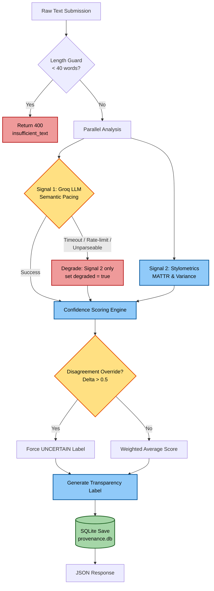
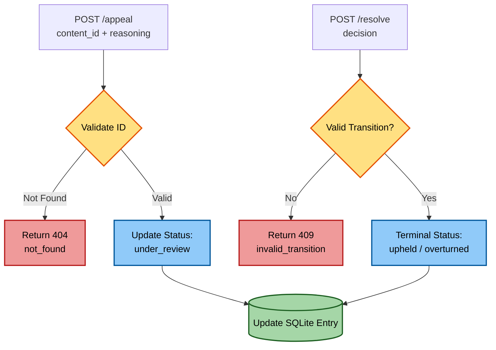

# Provenance Guard — System Specification & Planning

## 🏗️ Architecture

### System Flow Diagrams

**📩 Submission Flow (`POST /submit`)**



**⚖️ Appeal & Resolution Flow**



<details>
<summary>Text fallback (for viewers without Mermaid)</summary>

**Submission Flow:** `POST /submit` ➔ `Signal 1 (Groq LLM)` + `Signal 2 (Stylometrics)` ➔ `Confidence Scoring Engine` ➔ `Transparency Label Generator` ➔ `Write to Audit Log` ➔ JSON Response

**Appeal Flow:** `POST /appeal` ➔ Validate `content_id` ➔ Update Status to `"under_review"` ➔ `POST /resolve` ➔ Terminal Status (`upheld` / `overturned`) ➔ JSON Confirmation

</details>

### Persistence
The audit log is a single **SQLite** database (`provenance.db`), not a flat JSON file. This avoids file-corruption from concurrent `/submit` writes and gives us indexed lookups by `content_id` and `status` for the reviewer view. One table, `submissions`, holds the full record (signals, score, label, status, reasoning, timestamps).

---

## ⚙️ Core Components

### 1. Detection Signals
* **Signal 1 (Semantic):** Groq API using `llama-3.3-70b-versatile`. It returns a probability float (`0.0` to `1.0`) indicating the likelihood that the text is AI-generated based on semantic and structural pacing.
    * *Blind spot:* Highly polished, academic, or formal human writing.
    * *Reliability:* Call is made at `temperature=0` with a fixed prompt that demands a single float, and the response is parsed/clamped to `[0.0, 1.0]`. If Groq times out, rate-limits, or returns an unparseable response, the system **degrades to Signal 2 only** and tags the response with `"degraded": true` (see Error Handling).
* **Signal 2 (Structural/Statistical):** Native Python Stylometrics computing **Sentence Length Variance** and **Type-Token Ratio (TTR)**. Returns a normalized score from `0.0` (highly chaotic/human) to `1.0` (highly uniform/AI).
    * *Blind spot:* Short text submissions, repetitive poetic structures, or highly structured human lists.
    * *TTR note:* Raw TTR drops as text gets longer, so it partly just measures length. We compute it over a fixed-size moving window (MATTR, window = 50 tokens) to keep the score comparable across submissions.

### 2. Uncertainty Representation & Scoring
The combined score is a weighted average: 
$$\text{Final Score} = (0.6 \times \text{Groq Score}) + (0.4 \times \text{Stylometric Score})$$

* **Score < 0.40:** Likely Human-Written
* **0.40 ≤ Score ≤ 0.70:** Uncertain / Mixed Signals
* **Score > 0.70:** Likely AI-Generated

**Rationale (and that these are tunable):** Groq carries the heavier `0.6` weight because semantic judgment generalizes better than two hand-rolled statistics; stylometrics gets `0.4` as a cheap, deterministic counterweight that still works when the LLM is degraded. The `0.40 / 0.70` cutoffs are starting values, not ground truth — they will be calibrated against the labeled test set (see **Validation Plan**) and are stored as constants so they can be adjusted in one place.

**Disagreement override:** If the two signals diverge sharply (`abs(groq_score - stylometric_score) > 0.5`), the result is forced to **Uncertain / Mixed Signals** regardless of the weighted average. This is what catches the edge cases below — a confident human signal colliding with a confident "AI" stylometric flag should never silently average into a clean verdict.

### 3. Transparency Label Design
* **High-Confidence Human:** `"Verified Original: Our analysis indicates this content matches human writing patterns."`
* **Uncertain:** `"Mixed Signatures: This text contains a blend of structural patterns that make its origin ambiguous."`
* **High-Confidence AI:** `"AI-Generated Pattern: This text closely aligns with algorithmic generation characteristics."`

### 4. Appeals Workflow
* **Inputs:** `content_id`, `creator_reasoning`.
* **Action:** System updates the log entry status from `"classified"` to `"under_review"` and stores the `creator_reasoning`.
* **Reviewer View:** A filtering of the audit log where `status == 'under_review'`.
* **Closing the loop:** A reviewer resolves an appeal via `POST /resolve` (`content_id`, `decision`), moving status to a terminal `"upheld"` (original label stands) or `"overturned"` (label corrected). The decision and a timestamp are appended to the record so the full history is auditable. Valid status transitions: `classified → under_review → {upheld | overturned}`.

### 5. Anticipated Edge Cases
1.  **Technical Whitepapers:** Formal human prose that triggers high uniform scores on both signals.
    * *Mitigation:* This is the hard case — both signals agree and they're both wrong. We accept it as a known limitation, but the **minimum-length guard** and the transparency label's "analysis indicates" hedging keep us from claiming false certainty.
2.  **Repetitive Poetry:** Creative human work with low vocabulary diversity (TTR) triggering false AI flags on stylometrics.
    * *Mitigation:* Groq (the human-leaning signal here) and stylometrics (the AI-leaning signal) will diverge, so the **disagreement override** forces an Uncertain label instead of a false AI verdict.
3.  **Very short submissions:** Stylometrics is meaningless on a sentence or two.
    * *Mitigation:* A **minimum-length guard** (`< 40 words`) short-circuits scoring and returns an `"insufficient_text"` label rather than a confidence score.

---

## 🔌 API Contracts

### `POST /submit`
**Request**
```json
{ "text": "string (required)", "author_id": "string (optional)" }
```
**Response**
```json
{
  "content_id": "uuid",
  "final_score": 0.62,
  "label": "Mixed Signatures: ...",
  "classification": "uncertain",
  "signals": { "groq": 0.71, "stylometric": 0.48 },
  "status": "classified",
  "degraded": false,
  "created_at": "2026-06-30T12:00:00Z"
}
```

### `POST /appeal`
**Request** `{ "content_id": "uuid", "creator_reasoning": "string" }`
**Response** `{ "content_id": "uuid", "status": "under_review" }`

### `POST /resolve`
**Request** `{ "content_id": "uuid", "decision": "upheld | overturned" }`
**Response** `{ "content_id": "uuid", "status": "upheld" }`

**Error shape (all endpoints):** `{ "error": "message", "code": "insufficient_text | not_found | bad_request | invalid_transition" }` with the matching HTTP status (`400` / `404` / `409`).

---

## 🛡️ Error Handling & Resilience
* **Groq failure (timeout / rate-limit / unparseable):** fall back to Signal 2 only, set `"degraded": true`, and log the failure. The system never 500s on a flaky upstream.
* **Validation:** `/submit` rejects empty or non-string `text` with `400`; `/appeal` and `/resolve` reject unknown `content_id` with `404`.
* **Concurrency:** SQLite handles the write serialization; appends are single transactions so the log can't be left half-written.

---

## ✅ Validation Plan
A small labeled fixture set drives calibration and a basic regression check:
* **5 known human** samples (incl. 1 whitepaper, 1 poem) → expect Human or Uncertain, never confident AI.
* **5 known AI** samples → expect AI or Uncertain.
* **2 edge cases** (short text, signal-disagreement) → expect `insufficient_text` / Uncertain.

**Success criteria:** confident-human and confident-AI samples land in the right band; no edge case produces a confident *wrong* verdict; thresholds tuned so the Uncertain band absorbs ambiguity rather than the system guessing.

---

## 🤖 AI Tool Plan
* **Milestone 3:** Provide the Architecture diagram and Detection Signals spec to generate the Flask boilerplate and the Groq LLM signature wrapper.
* **Milestone 4:** Provide the full scoring logic to implement the native statistical functions.
* **Milestone 5:** Provide the production spec to generate the rate-limiting configuration and appeal logic.